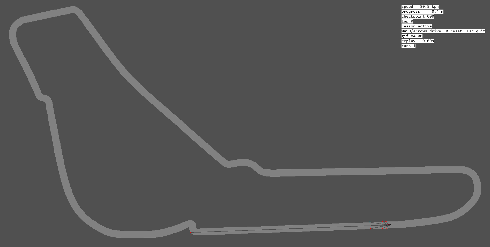
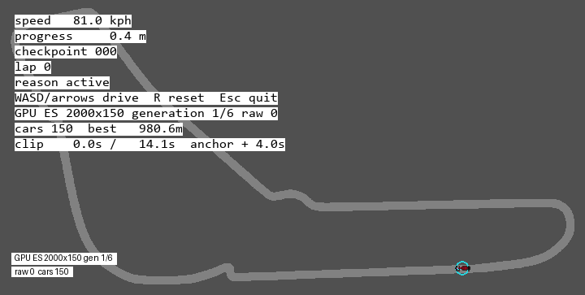

# F1 Reinforcement Learning

A custom Formula 1 racing-AI lab combining FastF1-calibrated vehicle physics, CUDA evolutionary search, behavior cloning, and Soft Actor-Critic reinforcement-learning infrastructure.

The learned policy completes Monza in **78.683 seconds** against an **89.327-second FastF1 qualifying benchmark**. Everything beneath the learning algorithms—the simulator, vehicle dynamics, observation system, telemetry, replay engine, calibration pipeline, and CPU verification path—was built as part of the project.

<p align="center">
  
  <br />
  <em>The promoted learned policy completing a CPU-verified Monza lap.</em>
</p>

## Product and highlights

The project treats racing AI as a complete systems problem rather than a call to an existing RL library.

Highlights include:

- A Gymnasium-compatible top-down Monza simulator.
- Vehicle dynamics covering tire slip, force saturation, weight transfer, gearing, brake bias, surfaces, curbs, and collisions.
- Calibration against real FastF1 telemetry with an independent OpenF1 cross-check.
- CUDA evolutionary search across **300,000 controller candidates**.
- CPU reranking and deterministic replay before any GPU result is promoted.
- Behavior cloning that distills search-discovered trajectories into a neural policy.
- A project-native PyTorch SAC pipeline for off-policy reinforcement learning.
- Versioned physics, observation, action, and calibration contracts across every artifact.

### Lap-time progression

| Stage | CPU-verified lap |
|---|---:|
| Physics V1, CPU evolutionary search | ~89s |
| Physics V1, GPU evolutionary search | 81.233s |
| Physics V1, learned policy | 79.750s |
| Physics V2, GPU evolutionary search | 78.683s |
| Physics V2, promoted learned policy | **78.683s** |

<p align="center">
  
  <br />
  <em>Physics V1 evolutionary search progressing from unstable controllers to complete laps.</em>
</p>

## How the racing AI works

The pipeline has five stages:

```text
FastF1 calibration
        ↓
custom physics simulator
        ↓
CUDA evolutionary search
        ↓
CPU verification and trajectory export
        ↓
behavior cloning + SAC policy workflow
```

### Simulator and vehicle model

The simulator runs Monza as a 5,793-meter, 60 Hz environment. The car must brake, accelerate, rotate through corners, manage curbs, remain within track limits, and cross ordered checkpoints before a lap is considered valid.

Physics V2 models:

- Tire slip angle and lateral-force saturation
- Longitudinal and lateral weight transfer
- An eight-gear torque curve
- Brake-bias instability
- Asphalt, curb, grass, and wall behavior
- Oriented car-body collision checks
- Surface-dependent grip and recovery behavior

The physics version and calibration ID are written into every artifact so results from incompatible simulator versions cannot silently mix.

### Observations and actions

The `racing_v2` observation profile contains 35 features, including:

- Speed and heading
- Lateral track error
- Lap progress
- Seven ray-cast distances
- Lookahead heading
- Target speed and upcoming target-speed drops
- Braking-gate proximity
- Curvature and section-aware features

The learned policy controls three independent continuous channels:

```text
throttle
brake
steering
```

Throttle and brake remain independent because the expert telemetry contains meaningful simultaneous use that would be lost under a single dominance heuristic.

### Evolutionary search

Evolutionary search is the discovery engine.

A population of controllers is evaluated in parallel. The strongest valid controllers survive; mutation and crossover generate the next population. Selection pressure rewards fast, complete, stable laps rather than controllers that gain short-term progress and crash.

The largest campaign used:

- 2,000 controllers per generation
- 150 generations
- A fused NVIDIA Warp/CUDA kernel
- 300,000 evaluated candidates

GPU results are proposals, not final evidence. Candidates must survive CPU postchecking, reranking, telemetry generation, and deterministic replay before they count.

<p align="center">
  
  <br />
  <em>The strongest V2 controller after CPU reranking and replay verification.</em>
</p>

### Behavior cloning

Verified search trajectories become supervised training data:

```text
observation → throttle, brake, steering
```

Behavior cloning trains a neural policy to reproduce the expert controller’s action distribution. This converts a search-discovered trajectory into a compact policy that can run directly from observations rather than replaying a stored control sequence.

### Soft Actor-Critic

The project-native SAC implementation provides the reinforcement-learning layer:

- The **actor** maps observations to continuous driving actions.
- Two **Q critics** estimate the expected return of each state-action pair.
- Twin critics reduce optimistic value estimation.
- Target networks stabilize temporal-difference updates.
- A replay buffer mixes verified expert transitions with online simulator experience.
- Entropy regularization balances exploitation with controlled exploration.
- Deterministic CPU evaluation remains the final promotion gate.

The behavior-cloned policy provides a strong initialization; SAC then has the infrastructure to continue learning through off-policy simulator rollouts.

### Calibration and benchmarking

Physics V2 is calibrated against clean, dry FastF1 Monza telemetry from multiple seasons and drivers, with OpenF1 used as an independent cross-check.

Calibration compares:

- Acceleration profiles
- Terminal speeds
- Braking-zone distances
- Gear and RPM behavior
- Corner speeds
- Lateral-force margins

The **89.327-second qualifying reference** is the external benchmark for the **78.683-second learned-policy result**. Claims remain scoped to the project’s calibrated top-down simulator rather than physical Formula 1 equivalence.

### Technologies and external dependencies

- **Simulation:** Python, NumPy, Gymnasium, Pygame, OpenCV
- **Learning:** PyTorch, Stable-Baselines3, PPO, behavior cloning, SAC
- **GPU search:** CUDA, NVIDIA Warp
- **Telemetry:** FastF1, OpenF1 reference data
- **Validation:** Pytest, Ruff, Pyright
- **Packaging:** uv, Hatchling

### Repository structure

```text
F1-ReinforcementLearning/
├── src/f1rl/             # Simulator, physics, search, learning, replay, telemetry
├── tools/                # GIF tools, recovery utilities, and tests
├── assets/               # Track assets and reference telemetry
├── artifacts/            # Curated telemetry, replays, GIFs, and manifests
├── docs/                 # Physics V3 and future RL plans
├── archive/docs/         # Historical plans and achievement reports
├── Documentation.md      # Technical status and validated campaign record
└── pyproject.toml        # Dependencies, extras, and command entry points
```

## Quick start

Requires Python 3.11 or 3.12 and `uv`.

```powershell
uv sync --active --all-extras --all-packages
```

Replay the promoted policy:

```powershell
uv run --no-sync python -m f1rl.replay "artifacts\highlights\physics2\gpu-rl\telemetry\learned_policy_promotion" --speed 4
```

Drive manually:

```powershell
uv run --no-sync python -m f1rl.manual --physics-model v2 --ghost-reference --flying-start
```

Validate:

```powershell
uv run --no-sync ruff check .
uv run --no-sync pyright src/f1rl
uv run --no-sync pytest -q
```
