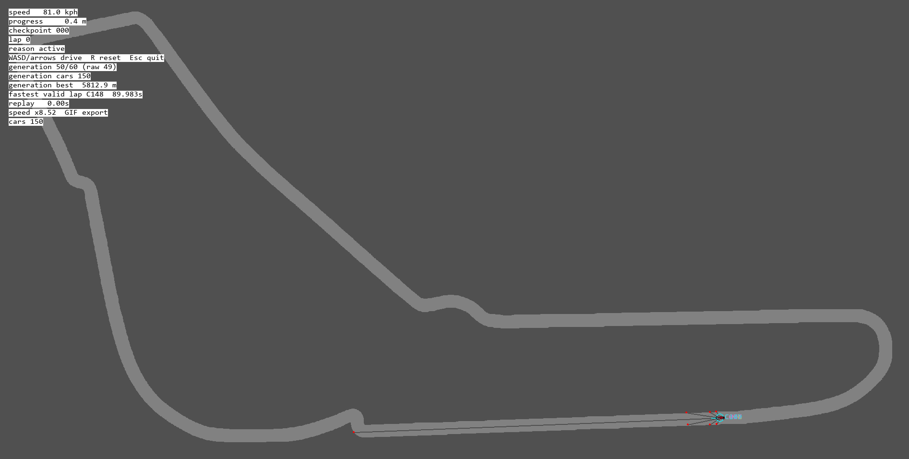
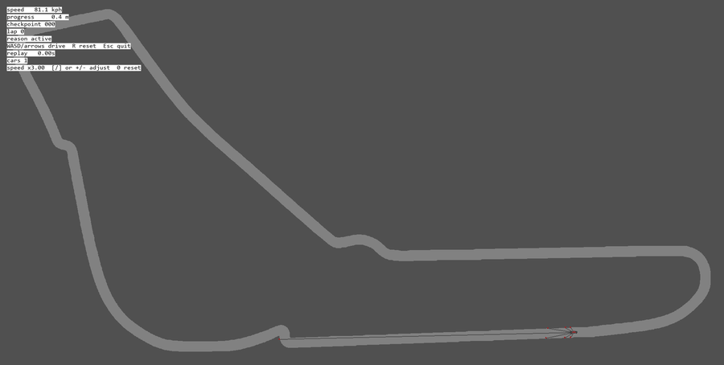

# F1 Reinforcement Learning

Top-down 2D Monza simulator, replay system, PPO training harness, and evolutionary search platform.

The project started as a Gymnasium/SB3 PPO driving experiment. PPO infrastructure works, but the strongest result now comes from GPU evolutionary search over continuous driving controllers, with CPU replay verification as the promotion oracle.

<p align="center">
  
</p>

<p align="center">
  
</p>

## Current Result

Best current evolved lap:

- Source run: `C:\f1rl-artifacts\gpu-speed-speedprofiles-2000x150-25k-20260605`
- Search scale: `2000` population x `150` generations = `300,000` candidates
- Backend: GPU fused evolutionary search
- Max steps: `25000`
- Target termination: disabled
- Fastest selected valid lap: `81.233s`
- CPU-verified selected candidate: generation `143`, candidate `1864`
- CPU verification result: `lap_complete`
- CPU/GPU reason mismatches: `0`
- CPU/GPU valid-lap mismatches: `0`
- Selected replay telemetry:
  `C:\f1rl-artifacts\gpu-speed-speedprofiles-2000x150-25k-20260605\selected_telemetry_summary_top`

The previous major milestone was a CPU-evolution result around `89s`. GPU ES moved the project from "valid evolved lap" to "near target evolved lap."

## What Exists

- `src/f1rl/sim.py`: shared CPU simulator and oracle.
- `src/f1rl/env.py`: Gymnasium environment for SB3 PPO.
- `src/f1rl/train.py`: CPU/Gym/SB3 PPO training entrypoint.
- `src/f1rl/gpu_ppo.py`: experimental custom GPU PPO path.
- `src/f1rl/evolution_search.py`: CPU/GPU evolutionary search.
- `src/f1rl/evolution_postcheck.py`: deferred CPU replay/rerank verification for GPU search.
- `src/f1rl/evolution_ladder.py`: repeatable search ladder runner.
- `src/f1rl/replay.py`: pygame/headless replay for telemetry.
- `src/f1rl/telemetry.py`: telemetry schema, summaries, and loading.

Legacy diagnostics still exist, but are not the main path:

- `src/f1rl/action_search.py`
- `src/f1rl/elite_search.py`

## Active Direction

The current practical path is:

1. Use GPU evolutionary search to discover fast valid laps.
2. CPU-verify/rerank selected winners.
3. Preserve replayable selected telemetry.
4. Export a broad verified transition dataset from ES traces.
5. Train a learned neural policy from that data with behavior cloning.
6. Fine-tune with off-policy RL, likely SAC or TD3.
7. Optionally inject the learned actor back into ES as a smart candidate source.

PPO is still real and useful as infrastructure, but blind PPO is not the current lead path.

Detailed learned-policy goal docs:

- `docs/CurrentPhysicsLearnedPolicyPlan.md`
- `docs/PhysicsV2LearnedPolicyPlan.md`

## Setup

```powershell
cd "C:\Users\kushagra\OneDrive\Documents\CS Projects\F1-ReinforcementLearning"
uv sync --active --all-extras --all-packages
```

Hardware check:

```powershell
uv run --no-sync f1-hardware-check --json --warp-smoke
```

## Core Commands

CPU simulator / manual driving:

```powershell
uv run --no-sync python -m f1rl.manual
```

Replay selected telemetry:

```powershell
uv run --no-sync python -m f1rl.replay "C:\f1rl-artifacts\gpu-speed-speedprofiles-2000x150-25k-20260605\selected_telemetry_summary_top"
```

Headless replay smoke:

```powershell
uv run --no-sync python -m f1rl.replay "C:\f1rl-artifacts\gpu-speed-speedprofiles-2000x150-25k-20260605\selected_telemetry_summary_top" --headless --limit 1
```

Evolution search help:

```powershell
uv run --no-sync python -m f1rl.evolution_search --help
uv run --no-sync python -m f1rl.evolution_postcheck --help
uv run --no-sync python -m f1rl.evolution_ladder --help
```

CPU evolution smoke:

```powershell
uv run --no-sync python -m f1rl.evolution_search --output-dir artifacts\evolution-smoke --start-progress-m 500 --start-speed-kph 80 --target-progress-m 510 --action-set straight --observation-profile base --max-steps 24 --population 8 --generations 2 --elite-count 2 --random-immigrants 1 --top-k 2 --workers 1 --genome-type phase --scoring-profiles max_progress,clean_exit --progress-every-generation
```

GPU fused production shape:

```powershell
uv run --no-sync python -m f1rl.evolution_search --backend gpu --gpu-engine fused --gpu-run-mode production --gpu-device cuda --gpu-dtype float32 --gpu-fast-geometry local_window --gpu-collision-mode exact_grid --gpu-cpu-replay-top-k 0 --gpu-telemetry-mode none --start-progress-m 0 --start-speed-kph 80 --target-progress-m 5793 --no-target-termination --action-set racing --observation-profile racing_v2 --max-steps 25000 --population 1000 --generations 75 --elite-count 96 --random-immigrants 96 --top-k 24 --workers 1 --genome-type controller --scoring-profiles fast_valid_lap,time_attack,lap_pace,fast_frontier,frontier_fast,farthest_distance,clean_distance,max_progress --progress-every-generation --output-dir C:\f1rl-artifacts\example-gpu-es
```

Deferred CPU postcheck/rerank:

```powershell
uv run --no-sync python -m f1rl.evolution_postcheck C:\f1rl-artifacts\example-gpu-es --top-k 8 --candidate-pool-size 96 --cpu-rerank --workers 8 --telemetry-compression gzip
```

SB3 PPO smoke:

```powershell
uv run --no-sync python -m f1rl.train --timesteps 16 --seed 91 --n-envs 1 --max-steps 8 --device cpu --checkpoint-every 0 --eval-every 0 --telemetry none --run-name validation-sb3-smoke --action-mode continuous --observation-profile base --n-steps 8 --batch-size 8 --n-epochs 1
```

GPU PPO smoke:

```powershell
uv run --no-sync python -m f1rl.gpu_ppo --device cuda --require-gpu --dtype float32 --output-dir artifacts\gpu-ppo-smoke --timesteps 16 --n-envs 2 --n-steps 4 --batch-size 4 --n-epochs 1 --hidden-size 32 --max-steps 8 --observation-profile base --start-speed-kph 60 --target-progress-m 6 --terminate-at-target --cpu-eval-episodes 1 --cpu-eval-max-steps 8
```

## Validation

```powershell
uv run --no-sync ruff check .
uv run --no-sync pyright src/f1rl
uv run --no-sync pytest -q
uv run --no-sync f1-hardware-check --json --warp-smoke
```

Use focused checks first when changing a small area, then broaden to the full set above before commit.

## Repository Layout

- `src/f1rl/`: simulator, learning, search, replay, telemetry, and tooling code.
- `tests/`: unit, parity, backend, replay, and CLI smoke tests.
- `tools/`: focused diagnostic scripts.
- `assets/`, `imgs/`: visual assets and track images.
- `archive/`: historical plans, old docs, old media, and legacy snapshots.
- `artifacts/`: ignored local run artifacts.
- `C:\f1rl-artifacts`: large local run artifacts outside the repo working tree.

Root markdown is intentionally minimal:

- `README.md`: public overview and commands.
- `Documentation.md`: concise live status.
- `AGENTS.md`: agent operating rules.

Older markdown plans and writeups are archived under `archive/repo-cleanup-20260605/`.

## Current Caveats

- The `81.233s` result is an evolved controller result, not a PPO result.
- CPU PPO has not completed a valid normal-start lap.
- GPU PPO is implemented and smoke-tested, not learning-proven.
- Raw GPU search winners are not trusted until CPU postcheck/rerank passes.
- Large run artifacts can be tens of GB; keep only compact selected telemetry in the repo.
